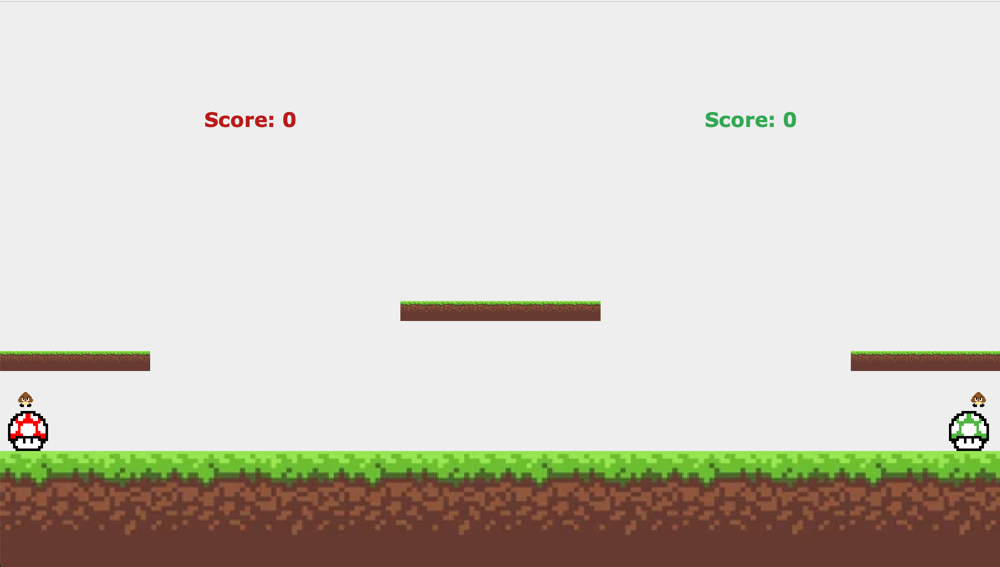
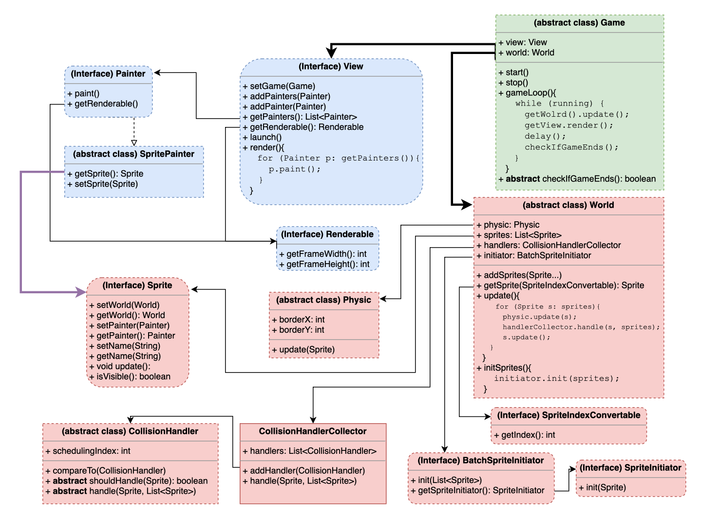
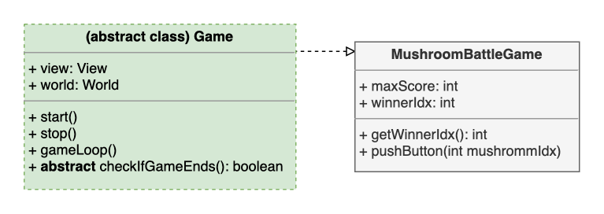
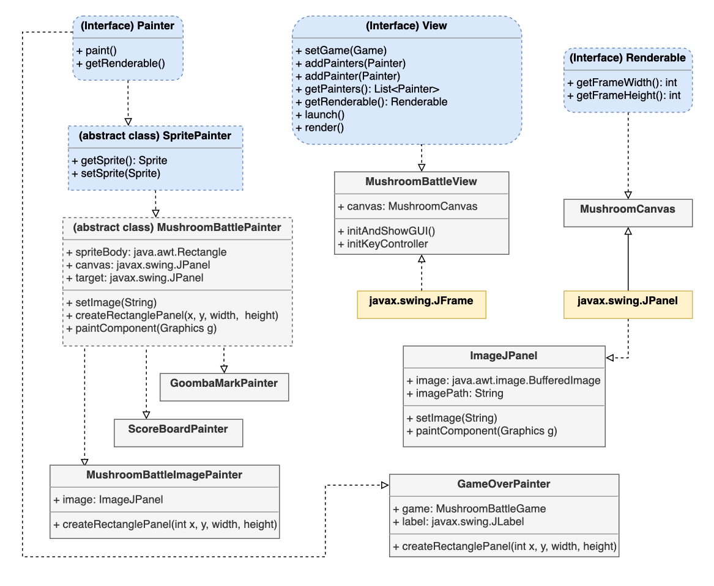
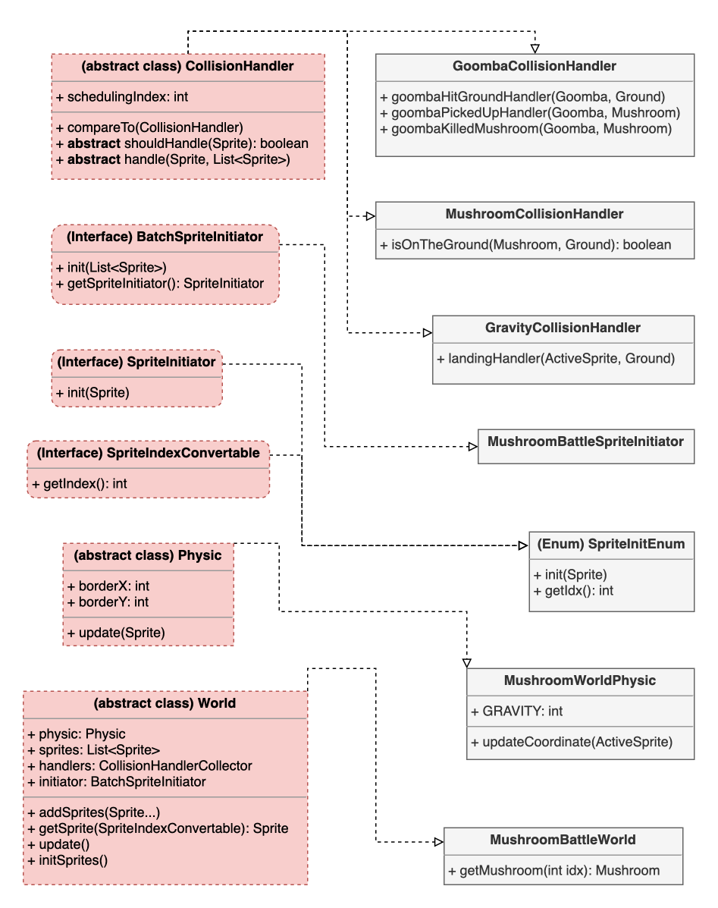
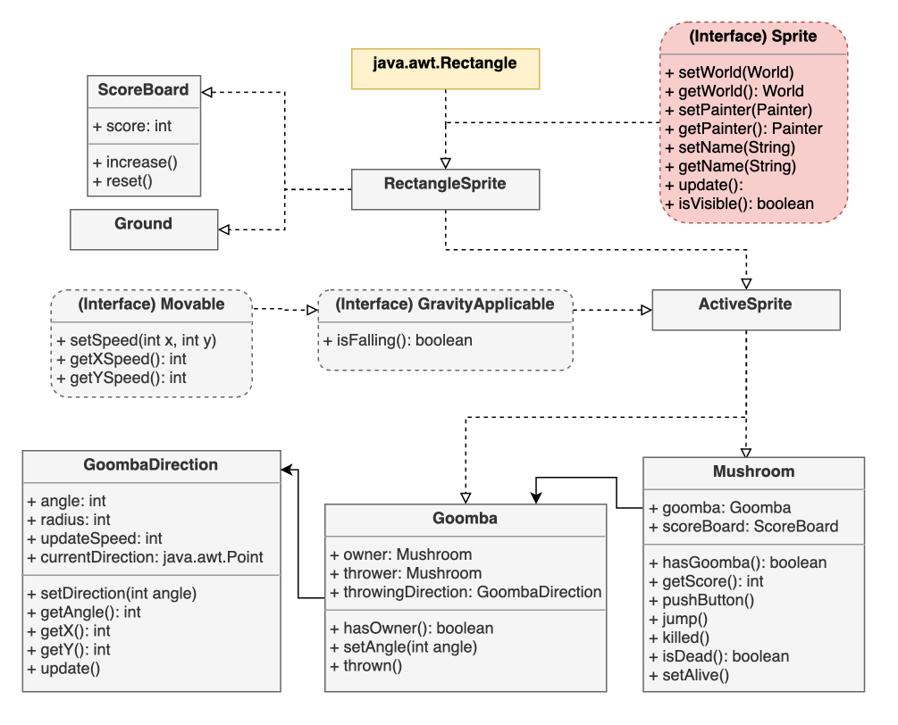

# FOOP Final Project - Mushroom Battle

- 隊名: 想不到好隊名怎麼辦
    - 組員：B07902027 高偉倫
- Demo link: [here](https://youtu.be/o5lRgqCPJMI)
## Game Introduction

Once upon a time, there are two mushrooms in the *Super Mushroom World*: **Power UP Mushroom** and **1-UP Mushroom**. To decide who is the BEST mushroom, they start fighting against each other by throwing **Goombas**. 
### Rules:
- Mushrooms will pick up Goombas on the ground automatically without being harmed.
- Once Goombas are picked up by a mushroom, it can be thrown against the other mushroom along the direction specified on the head of mushroom.
- If the thrown goomba hit the other mushrooms, it will **EAT THE MUSHROOM UP!**
- Mushrooms can jump. But they can jump **only when they're not holding any Goomba**.
- The first mushroom that gets **5** scores wins!
### How to play
- Enter `make run` in terminal under the root directory.
- Push **[SPACE]** (for the red mushroom) or **[ENTER]** (for the green mushroom) to *jump* or *throw the Goombas*.

## Software Design
我在設計軟體架構時，想達成的是將「一般遊戲邏輯」和「專屬於我這個遊戲的邏輯」分開。如此一來，就可以把「一般遊戲邏輯」的部份視為一個SDK（Software Development Kit），之後想寫其他遊戲的時候便可以根據自己的需求使用這套SDK。以下會以使用SDK的角度來介紹我的軟體架構。
### SDK Design

我使用Model-View-Controller的架構將我的軟體分成`sdk.view`, `sdk.controller`以及`sdk.model`三個package。

- `View`: 藍色部分
- `Controller`: 綠色部分
- `Model`：紅色部分
- 虛線箭頭從A指向B代表「B繼承A」
- 實心箭頭從A指向B代表「A擁有B」
- 特別粗的兩條黑色實心箭頭是controller唯二能夠控制View和World的管道
- 紫色箭頭代表View用來觀測Model的狀態並更新在GUI上的管道

其中，Model並不需要依賴View或Controller來運作，可以簡單地從「Controller與View都只有指向Model的箭頭」發覺。以下簡單介紹各個class的作用。
#### sdk.Controller
- Game.java
    - 掌管整個遊戲的流程，是View和Model之間的橋樑。
#### sdk.View
- View.java
    - 控制遊戲中所有跟玩家有關的事情：GUI以及鍵盤按鍵事件偵測。
- Renderable.java
    - 代表畫布的一個介面，使用者可以自己使用熟悉的GUI套件實作此介面，藉此達到將GUI implementation與抽象遊戲分開的目的。
- Painter.java
    - 可以將Painter與Model中的物件綁在一起作為觀測目標，並在呼叫`Painter.render()`的時候讀取此目標的的狀態，再將圖像呈現在`Renderable`上。
    - 當`View.render()`被呼叫的時候，View實際上會令所有已註冊的Painter呼叫`Painter.paint()`。
- SpritePainter.java
    - 繼承自Painter.java，強制規定綁定Model.Sprite作為目標。
#### sdk.Model
- World.java
    - 掌控遊戲中所有物件之間的互動。
- Sprite.java
    - 遊戲中能夠互動的物件之最基本類別。
- CollisionHandler.java
    - 負責遊戲中某種特定種類Sprite的碰撞處理。
- CollisionHandlerCollector.java
    - 負責收集此遊戲中所有的CollisionHandler，並讓Sprite可以被正確的CollisionHandler處理。
- SpriteInitiator.java
    - 負責在遊戲一開始初始化特定Sprite的屬性，例如：位置、速度、生死...。遊戲如果需要重置也可以使用它。
- BatchSpriteInitiator.java
    - 負責收集此遊戲中所有的SpriteInitiator，以方便一次初始化一大批不同種類的Sprite。
- Physic.java
    - 擔任遊戲中的物理引擎，根據不同的遊戲可以自定義不同的物理運算規則（例如：有/無重力、是否有空氣阻力...）。
- SpriteIndexConvertable.java
    - 因為World可以使用`World.add(Sprite)`來新增新的Sprite，使用者可以實作此一類別來當作Sprite的索引，用`World.getSprite(SpriteInexConvertable)`來提取指定的Sprite，讓Sprite的新增與刪除更靈活。

### Mushroom-Battle Design
接下來的部分是解釋Mushroom-Battle遊戲的實作類別與邏輯。這些類別全部都實作在`src/mushroom_battle`之下。我在實作這些遊戲邏輯時，也盡量遵守OCP，並使用了Dependency-Injection。以下將會分別簡單介紹我所實作的這些類別。在類別圖中：
- 黃色代表GUI實作相關的class（可以依據SDK使用者習慣自行抽換，這裡使用`javax.swing`相關的套件）
- 灰色代表Mushroom-Battle相關的所有物件

#### mushroom_battle.Controller

- MushroomBattleGame
    - 因為玩家從頭到尾只會按壓一個按鍵(ENTER或SPACE)，因此只實作代表按壓按鍵的方法。
    - 同時，此物件也要處理遊戲獲勝的條件。可以在初始化時設定先拿到`maxScore`分的人獲勝。

#### mushroom_battle.View

- MushroomBattleView.java
    - 實作按鍵事件偵測以及初始化GUI視窗process。
- MushroomCanvas
    - 實作`Renderable`類別。
- ImageJPanel
    - 用來代表圖片的類別，以方便使用Swing GUI進行繪圖。
- MushroomBattlePainter
    - 此遊戲中通用的Painter，需要指定一個Sprite當作監測目標，每次呼叫`paint()`時都會利用Swing GUI依照監測目標的位置畫出相對應的圖像。
- MushroomBattleImagePainter
    - 繼承自MushroomBattlePainter，在初始化時還需另外給定一張圖片位址，它會將此圖片畫在其該有的位置上。
- GoombaMarkPainter / ScoreBoardPainter / GameOverPainter
    - 針對特殊Sprite的Painter。

#### mushroom_battle.Model

- GoombaCollisionHandler / MushroomCollisionHandler / GravityCollisionHandler
    - 針對特定Sprite的CollisionHandler。
    - GravityHandler是針對有實作GravityApplicable這個介面的Sprite進行處理。
- MushroomBattleSpriteInitiator
    - 實作BatchSpriteInitiator這個介面，會在有Mushroom得分後被World呼叫，並將所有Sprite的位置與狀態重設。
    - 若呼叫getSpriteInitiator()，會回傳SpriteInitEnum.values()。
- SpriteInitEnum
    - 同時擔任SpriteInitiator以及SpriteIndex的責任。可以在整個`mushroom_battle`遊戲中都用來指定World中的特定Sprite。
    - 也因為Enum的方便性，只要在加入Sprite的時候注意順序，新增Sprite也變得很容易。
- MushroomWorldPhysic
    - 實作此遊戲中的物理引擎，主要是實作下墜和撞牆反彈的物理現象。
    - 下墜只適用於有實作GravityApplicable這個介面的Sprite。
    - 撞牆反彈只適用於有實作Moving這個介面的Sprite。
- MushroomBattleWorld
    - 負責此遊戲中所有物件的互動（包括碰撞、物理引擎、得分...）。
##### mushroom_battle.model.Sprite
 

此遊戲的Sprite較多，因此用另外一張圖來介紹關係。可以直接從此圖瞭解各個類別的相互關係。以下是一些比較重要的Sprite之介紹。

- Goomba
    - Goomba的實作。每隻Goomba都有一個GoombaDirection，代表此Goomba在每個時間點被丟出去的角度。
- Goomba Direction
    - 每呼叫一次update()就會依照updateSpeed更新到下一個角度去。從圓作標轉換到笛卡兒座標的計算在此類別被創造的時候就已經先完成並快取起來了。
- Movable
    - 實作此介面的Sprite代表其會在World中進行二維的移動。
- GravityApplicable
    - 實作此介面的Sprite代表其會受到重力影響而掉落。
- ActiveSprite
    - 此類別代表MushroomBattleWorld中會受玩家影響而移動的Sprite。
- RectangleSprite
    - 繼承了`java.awt.Rectangle`以方便Sprite的座標計算，此類別會以長方形的形狀存在於MushroomBattleWorld中。

## The advantage of my design
- 將一般遊戲邏輯與Mushroom-Battle的遊戲邏輯分開，並將前者包裝成一套SDK。如此一來，未來若想開發其他遊戲，可以直接使用同樣一套SDK，減少需要寫的程式碼數量。
- 使用MVC架構，可以指改動其中一部份而不需重構。
- 將GUI實作與抽象的View邏輯分離，以方便使用者使用自己熟悉的GUI。
- 將複雜的物理邏輯抽出、獨立成一個類別，方便除錯與修改時的統一。
- CollisionHandler與SpriteInitiator都是以dependency injection的方式加入主程式的，因此增加新的Sprite非常方便，只要定義好Sprite、讓它實作一些介面、再定義好CollisionHandler以及SpriteInitiator就可以將新的Sprite加入主程式了，完全符合OCP。
- Sprite的初始化完全交給SpriteInitiator與Constructor，因此只要在這兩個地方使用同一份Config檔(在我的程式裡我使用Constant.java這個class做設定），就能輕鬆設定Sprite的相關參數。
## The disadvantage of my design
- SDK的使用者會受限於SDK的邏輯與架構，自由度會因此減少。若使用者不喜歡其中某些寫法，想要更改其某一部份，成本會很高。
    - 如：不喜歡使用Painter進行繪圖，但View內部已經預設會使用`Painter.paint()`來繪圖了，此時若想更改其邏輯則需@Override許多方法，成本高昂。
- Mushroom和Goomba的相依性很高，若想針對其關係進行修改會需要一定程度的重構。
    - 例如，若想新增兩種新類別叫做Bomb與Minion，讓Mushroom/Minion可以拿Goomba/Bomb來丟擲，可能需要幾個新介面叫Thrower和Ownerable並進行重構。
- 常數的設定我使用了一個叫Constant.java的類別，裡面裝的是所有sprite的初始位置和所有參數的值（如重力、初始速度）。但這樣一來，每次要更改的話都需要重新編譯一次才能套用新設定，不是一種好方法。更好的方法應該是用讀檔的方式去讀設定，這樣在調整參數上（如調整重力大小）也更方便。
## Used package
- java.awt
- javax.swing
## 心得
這學期最喜歡的課就是這堂課了。因為學分數少，可以更深入探索課程內容的時間變多，便決定final project選擇一個人一組這條不歸路。辛苦是辛苦，確實也在一路上學了很多，諸如各種design pattern（雖然還是不太會用，只是大致了解意思）、各種抽象化的方法，到了最後實際把自己心中的軟體架構刻出來真的蠻開心的。除此之外，這學期最能讓我感受到OOP的威力其實都是在寫作業的後半段。以前在寫義大利麵程式碼的時候，花在debug的心力對時間的函數大概是一條斜率為正的斜線；這次寫三個OOP作業和一個Final Project體感的函數卻是負的！確實前面花在畫class diagram、設計架構、考慮OCP的心力比起以前是大幅增加沒錯，但後續需要花費在維護上的心力卻少得多，許多新feature加進去之後都是一次到位，測資一次過，這是以前從來沒有的感受。很開心這學期修了這門課，也謝謝助教提供的所有幫助與課程，我仍會在往OO的路上努力！
